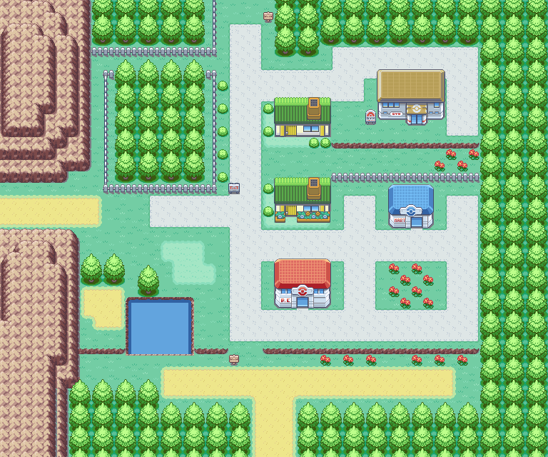

# Pokemon Plugin

The Pokemon plugin turns Pixel OPs into a classic handheld RPG-style operations dashboard for a 320x480 TURZX/Turing Smart Screen-style USB display. It combines time zones, meetings, pull requests, and work events with Pokemon encounters, map movement, sprites, and a game text box.


## What It Renders

- A FireRed/LeafGreen-inspired overworld scene.
- Ash walking through clean split map regions.
- A compact operations HUD with local time, team time zones, next meeting, and GitHub pull requests.
- Pokemon encounters triggered by meetings, pull requests, incidents, merges, reviews, and ambient events.
- Day/night palette changes based on the primary configured timezone.
- Preview PNG, animated GIF, or live TURZX USB output.


## Quick Start

Render a single PNG preview:

```bash
python pixel_ops/main.py --plugin pokemon --output preview
```

Render an animated GIF:

```bash
python pixel_ops/main.py --plugin pokemon --output gif --seconds 8
```

Run on the USB display:

```bash
python pixel_ops/main.py --plugin pokemon --output turzx --forever --fps 10 --offline
```

Run with local calendar data:

```bash
python pixel_ops/main.py --plugin pokemon --output preview --ics path/to/calendar.ics
```

## Outputs

The plugin renders `PIL.Image` frames. Pixel OPs core sends those frames to the selected output target:

```text
PokemonPlugin -> OverworldScene -> PIL.Image -> DisplayOutput.send(frame)
```

Available output targets:

- `preview`: writes one PNG to `pixel_ops/output/preview.png`.
- `gif`: writes an animated GIF to `pixel_ops/output/preview.gif`.
- `turzx`: sends frames to the TURZX/Turing USB display backend.

Legacy aliases still work:

- `--preview` is equivalent to `--output preview`.
- `--gif` is equivalent to `--output gif`.
- `--display` is equivalent to `--output turzx`.

## Main Config Files

The plugin uses core Pixel OPs configuration plus two Pokemon-specific YAML files.

```text
pixel_ops/config/display.yaml
pixel_ops/config/people.yaml
pixel_ops/plugins/pokemon/game.yaml
pixel_ops/plugins/pokemon/pokemon.yaml
pixel_ops/plugins/pokemon/assets/sprites/ash/manifest.yaml
```

## Display Config

File: `pixel_ops/config/display.yaml`

Example:

```yaml
display:
  width: 320
  height: 480
  backend: usb_bulk_rev_a
  fps: 12
  preview_output: pixel_ops/output/preview.png
  gif_output: pixel_ops/output/preview.gif
  scanlines: false
  timezone_primary: America/Sao_Paulo
  weather:
    enabled: true
    city: Porto Alegre
    country_code: BR
    poll_seconds: 900
  ai:
    enabled: false
    provider: openai_chatgpt
    model: gpt-5.2-chat-latest
    api_key_env: OPENAI_API_KEY
    timeout_seconds: 8
    cache_enabled: true
    cache_dir: pixel_ops/cache/ai_decisions
  splash:
    enabled: true
    seconds: 2
    logo_path: pixel_ops/assets/logo/pixel_ops_gaco_logo.jpg
    background: [8, 10, 18]
```

Fields:

- `width`, `height`: target frame size. The current plugin is tuned for `320x480`.
- `backend`: hardware backend name. Current USB backend is `usb_bulk_rev_a`.
- `fps`: default frames per second when `--fps` is not provided.
- `preview_output`: PNG output path.
- `gif_output`: GIF output path.
- `scanlines`: overlays a subtle handheld-screen scanline effect when enabled.
- `timezone_primary`: timezone used for the main clock and day/night palette.
- `weather`: Open-Meteo polling config for map weather effects and the map weather badge.
- `ai`: optional Pixel OPs AI plugin config. The initial provider is `openai_chatgpt`, backed by the OpenAI Responses API. `cache_enabled` stores successful JSON decisions locally so repeated encounters do not spend tokens again.
- `splash.enabled`: shows the Pixel OPs logo before GIF and live display output.
- `splash.seconds`: splash duration.
- `splash.logo_path`: explicit image used for the splash logo.
- `splash.background`: RGB splash background color.

## People And Time Zones

File: `pixel_ops/config/people.yaml`

Example:

```yaml
people:
  - key: BRT
    name: Marcelo, Time
    country: BR
    timezone: America/Sao_Paulo
    timezone_label: Brazil
    work_start: "09:00"
    work_end: "18:00"
  - key: PT
    name: Product Team
    country: US
    timezone: America/Los_Angeles
    timezone_label: Pacific
    standard_key: PST
    daylight_key: PDT
    work_start: "09:00"
    work_end: "17:00"
```

Fields:

- `key`: short label rendered in the HUD.
- `name`: people or team names for that timezone.
- `country`: compact country label.
- `timezone`: IANA timezone name.
- `timezone_label`: human-friendly label.
- `standard_key`, `daylight_key`: optional seasonal abbreviations.
- `work_start`, `work_end`: workday window used by the HUD status.

## Game Config

File: `pixel_ops/plugins/pokemon/game.yaml`

Current full example:

```yaml
game:
  fps: 10
  static_background: true
  require_ash_sprite: false
  ash_sprite_source: https://www.spriters-resource.com/game_boy_advance/pokemonfireredleafgreen/asset/52432/
  ash_sprite_file: pixel_ops/plugins/pokemon/assets/sprites/ash/ash_overworld.png
  world_speed_px: 0
  map_switch_seconds: 300
  ash_x: 118
  ash_y: 292
  walk_start_x: 28
  encounter_x: 132
  walk_exit_x: 258
  route_speed_px: 6.4
  pokemon_x: 220
  pokemon_y: 280
  hud_height: 212
  text_box_height: 76
  encounter:
    walking_seconds: 1.5
    start_seconds: 1.4
    appears_seconds: 1.1
    throw_seconds: 0.8
    shake_seconds: 1.0
    caught_seconds: 0.9
  events:
    mock_events: false
    queue_limit: 6
    knowledge_path: pixel_ops/plugins/pokemon/assets/knowledge/gen1_lore.json
    ai_selector:
      enabled: false
      ambient: false
      candidate_limit: 8
    event_pokemon_types:
      pull_request:
        - bug
        - electric
        - fighting
      meeting:
        - psychic
        - fairy
    repo_biomes:
      backend:
        - rock
        - steel
        - ground
      frontend:
        - electric
        - psychic
        - fairy
      infra:
        - dragon
        - ghost
        - dark
```

Scene fields:

- `fps`: plugin default FPS.
- `static_background`: keeps the map fixed while Ash moves.
- `world_speed_px`: fallback generated-world scrolling speed. Current map mode uses `0`.
- `map_switch_seconds`: how often the scene picks another split map area.
- `ash_x`, `ash_y`: default Ash position for encounter scenes.
- `walk_start_x`, `encounter_x`, `walk_exit_x`: horizontal route positions for the encounter loop.
- `route_speed_px`: Ash movement speed in pixels per frame.
- `pokemon_x`, `pokemon_y`: encounter Pokemon position.
- `hud_height`: top HUD height.
- `text_box_height`: bottom text box height.

Encounter timing fields:

- `walking_seconds`: time spent walking before an encounter starts.
- `start_seconds`: pre-encounter pause.
- `appears_seconds`: Pokemon reveal duration.
- `throw_seconds`: trainer throw animation duration.
- `shake_seconds`: Poke Ball shake duration.
- `caught_seconds`: caught confirmation duration.

Event fields:

- `mock_events`: enables generated demo events when no real source is configured.
- `queue_limit`: maximum pending work events in the encounter queue.
- `knowledge_path`: optional local Pokemon lore/keyword JSON used as a tiny RAG knowledge base before AI calls.
- `ai_selector`: lets the Pokemon plugin build an AI prompt for Pokemon choice and the short appearance message when a Pixel OPs AI plugin is enabled. If no AI plugin is available or the call fails, the deterministic selector and local text are used.
- `event_pokemon_types`: maps event categories to preferred Pokemon types.
- `repo_biomes`: maps repository keywords to Pokemon type pools.

Supported event categories:

```text
pull_request
meeting
build_broken
deploy_started
deploy_completed
review_requested
message_important
incident
merge
pr_closed
pr_approved
ambient
```

Enable AI Pokemon decisions:

```bash
OPENAI_API_KEY=sk-... python pixel_ops/main.py --plugin pokemon --output preview
```

Then set `display.ai.enabled: true` in `pixel_ops/config/display.yaml` and `game.events.ai_selector.enabled: true` in `pixel_ops/plugins/pokemon/game.yaml`. The Pokemon plugin first searches the local knowledge base from `knowledge_path`, sends only `candidate_limit` candidates to the model, and caches successful decisions under `pixel_ops/cache/ai_decisions`. The response chooses one candidate and writes a compact battle text box appearance phrase. Set `ambient: true` only if you want AI calls for ambient encounters too; otherwise it is used for real work events such as PRs, closed PRs, and meetings.

Local Pokemon lore uses this shape:

```json
{
  "pokemon": [
    {
      "number": 25,
      "name": "Pikachu",
      "types": ["electric"],
      "keywords": ["frontend", "review", "approval"],
      "lore": "Pikachu is quick to spark when small signals need attention."
    }
  ]
}
```

## Pokemon API And Cache Config

File: `pixel_ops/plugins/pokemon/pokemon.yaml`

Example:

```yaml
pokemon:
  api_base_url: https://pokeapi.co/api/v2
  sprite_base_url: https://raw.githubusercontent.com/PokeAPI/sprites/master/sprites/pokemon
  cache_dir: pixel_ops/plugins/pokemon/assets/cache
  generation_limit: 151
  sprite_style: animated
  network_timeout_seconds: 8
  lazy_download: true
```

Fields:

- `api_base_url`: PokeAPI base URL.
- `sprite_base_url`: sprite repository base URL.
- `cache_dir`: local metadata and sprite cache directory.
- `generation_limit`: default Pokemon range. `151` keeps the plugin focused on Gen 1.
- `sprite_style`: `animated` or `front`.
- `network_timeout_seconds`: request timeout for API and sprite downloads.
- `lazy_download`: downloads missing data during runtime unless `--offline` is used.

Warm the complete Gen 1 cache:

```bash
python pixel_ops/main.py --plugin pokemon --warm-cache
```

Warm a smaller development cache:

```bash
python pixel_ops/main.py --plugin pokemon --warm-cache --pokemon-limit 25
```

Run only with cached assets:

```bash
python pixel_ops/main.py --plugin pokemon --output preview --offline
```

Cache layout:

```text
pixel_ops/plugins/pokemon/assets/cache/api/
pixel_ops/plugins/pokemon/assets/cache/pokemon/front/
pixel_ops/plugins/pokemon/assets/cache/pokemon/animated/
```

## Maps

Original map sheets live here:

```text
pixel_ops/plugins/pokemon/assets/maps/firered_leafgreen/
```

Runtime uses cleaned map-only PNG files generated from the original sheets:

```text
pixel_ops/plugins/pokemon/assets/maps/firered_leafgreen_clean/
```

Example clean map:



Regenerate clean maps after adding or replacing sheets:

```bash
python pixel_ops/plugins/pokemon/tools/split_map_sheets.py
```

The map route manager scans every clean PNG, detects usable map bounds, creates viewport crops, and generates walkable routes from the resulting map image.

## Trainer Sprites

The bundled Ash sprite assets live here:

```text
pixel_ops/plugins/pokemon/assets/sprites/ash/
```

Current extracted overworld sprite:


Sprite manifest example:

```yaml
scale: 2
frame_width: 16
frame_height: 20
transparent_color:
  - 255
  - 127
  - 39
animations:
  walk_down:
    file: Game Boy Advance - Pokemon FireRed _ LeafGreen - Playable Characters - Player Sprites.png
    boxes:
      - [8, 53, 16, 20]
      - [25, 53, 16, 20]
      - [42, 53, 16, 20]
      - [25, 53, 16, 20]
    fps: 6
  catch:
    file: Game Boy Advance - Pokemon FireRed _ LeafGreen - Playable Characters - Player Sprites.png
    boxes:
      - [248, 52, 16, 20]
      - [281, 52, 16, 20]
      - [314, 52, 16, 20]
    fps: 8
```

Regenerate `ash_overworld.png` and `manifest.yaml` from a replacement sheet:

```bash
python pixel_ops/plugins/pokemon/tools/extract_ash_from_sheet.py path/to/player_sprites.png
```

If no trainer sprite exists, the plugin can fall back to generated pixel sprites. To fail fast instead, set:

```yaml
game:
  require_ash_sprite: true
```

## Calendar Events

Local one-off `.ics` file:

```bash
python pixel_ops/main.py --plugin pokemon --output preview --ics path/to/calendar.ics
```

Persistent calendar config through `.env`:

```env
PIXEL_OPS_ICS_ENABLED=true
PIXEL_OPS_ICS_PATH=/absolute/path/to/calendar.ics
PIXEL_OPS_ICS_POLL_SECONDS=300
```

Remote `.ics` URL:

```env
PIXEL_OPS_ICS_ENABLED=true
PIXEL_OPS_ICS_URL=https://example.com/calendar.ics
PIXEL_OPS_ICS_POLL_SECONDS=300
```

Multiple paths or URLs can be comma-separated:

```env
PIXEL_OPS_ICS_PATH=/path/team.ics,/path/personal.ics
PIXEL_OPS_ICS_URL=https://example.com/a.ics,https://example.com/b.ics
```

Calendar events become `meeting` work events and can trigger psychic/fairy-style Pokemon encounters by default.

## GitHub Events

Configure GitHub pull requests in `.env`:

```env
PIXEL_OPS_GITHUB_ENABLED=true
PIXEL_OPS_GITHUB_TOKEN=github_pat_...
PIXEL_OPS_GITHUB_REPOS=owner/repo,owner/another-repo
PIXEL_OPS_GITHUB_POLL_SECONDS=60
PIXEL_OPS_GITHUB_MAX_PRS=4
```

The token only needs read access to the configured repositories. GitHub pull requests appear in the HUD and can trigger `pull_request`, `review_requested`, `pr_approved`, and `merge` encounters.

Useful GitHub env vars:

```env
POKEMON_DASHBOARD_GITHUB_ENABLED=true
POKEMON_DASHBOARD_GITHUB_REPOS=owner/repo
POKEMON_DASHBOARD_GITHUB_POLL_SECONDS=60
POKEMON_DASHBOARD_GITHUB_MAX_PRS=4
POKEMON_DASHBOARD_GITHUB_FETCH_PRS=20
POKEMON_DASHBOARD_GITHUB_TIMEOUT_SECONDS=20
```

`MAX_PRS` controls how many PRs appear in the HUD. `FETCH_PRS` controls how many recent open PRs are scanned for encounters.

## Mock Events

Enable demo events without calendar or GitHub:

```env
PIXEL_OPS_MOCK_EVENTS=true
```

Or enable mock events in the plugin config:

```yaml
game:
  events:
    mock_events: true
```

## Common Recipes

Fast local preview with cached assets:

```bash
python pixel_ops/main.py --plugin pokemon --output preview --offline
```

Longer GIF for documentation:

```bash
python pixel_ops/main.py --plugin pokemon --output gif --seconds 16 --fps 10 --offline
```

USB display with full-frame writes:

```bash
python pixel_ops/main.py --plugin pokemon --output turzx --forever --fps 10 --full-frame --offline
```

Faster Ash movement:

```yaml
game:
  route_speed_px: 12.8
```

Shorter encounter loop:

```yaml
game:
  encounter:
    walking_seconds: 0.8
    start_seconds: 0.6
    appears_seconds: 0.8
    throw_seconds: 0.5
    shake_seconds: 0.7
    caught_seconds: 0.6
```

Different primary timezone:

```yaml
display:
  timezone_primary: America/New_York
```

Animated sprites disabled:

```yaml
pokemon:
  sprite_style: front
```

## Credits

Pokemon metadata and Pokemon sprites are downloaded from [PokeAPI](https://pokeapi.co/) and the public PokeAPI sprite repository when cache warming or lazy download is enabled.

FireRed/LeafGreen-style map and trainer sheets are stored as plugin assets for this local dashboard experience. Pixel OPs keeps them isolated inside the Pokemon plugin so future plugins can use different games or themes without depending on Pokemon-specific files.

The display protocol layer used by Pixel OPs is adapted from [`mathoudebine/turing-smart-screen-python`](https://github.com/mathoudebine/turing-smart-screen-python), which decoded and implemented support for Turing Smart Screen style devices.
